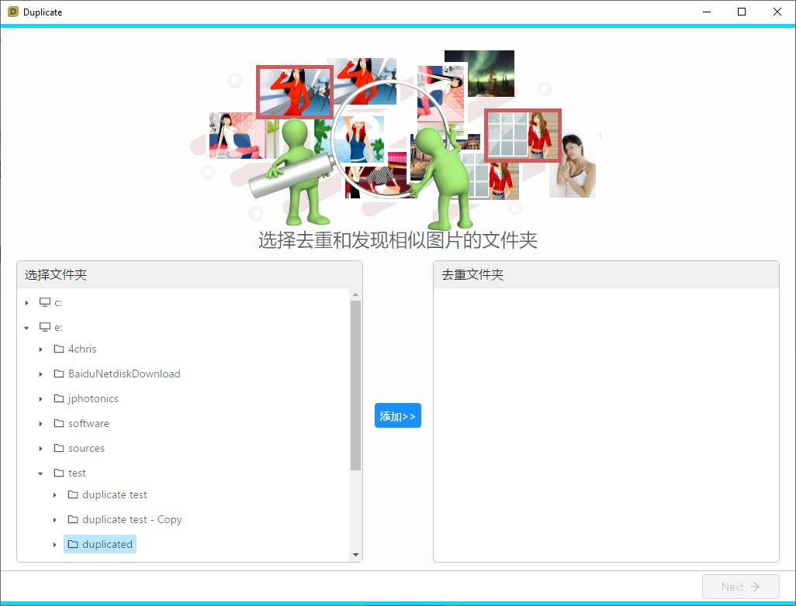
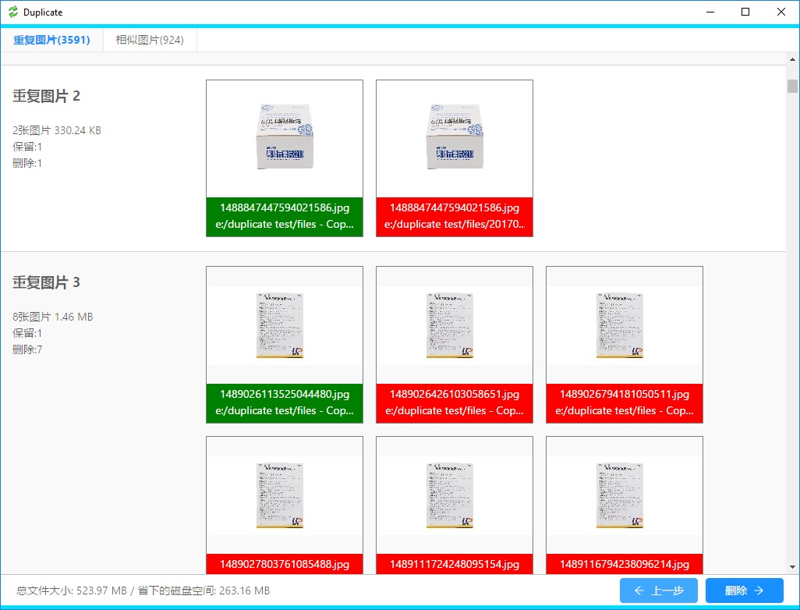
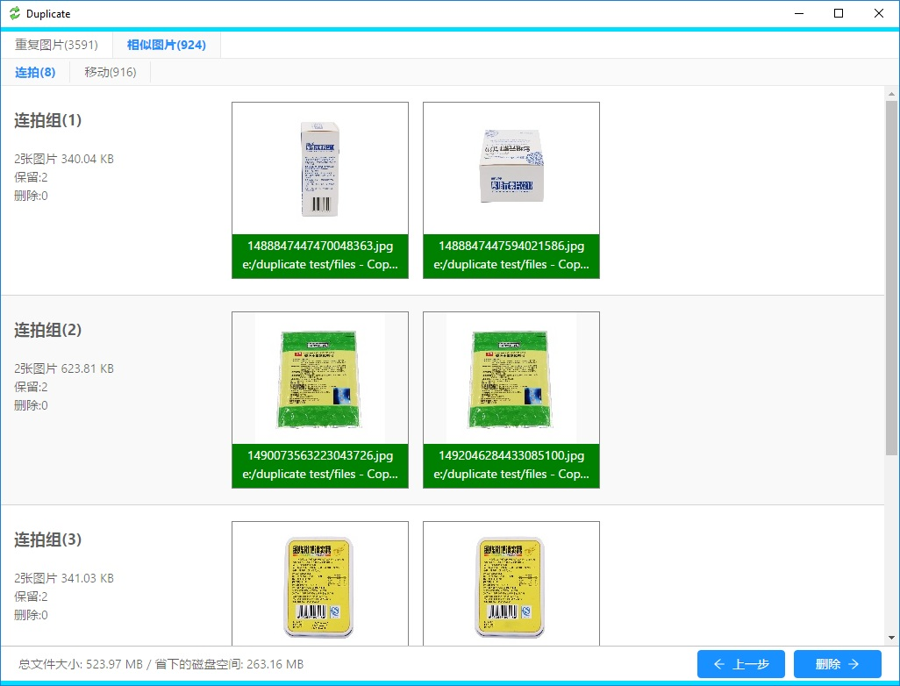
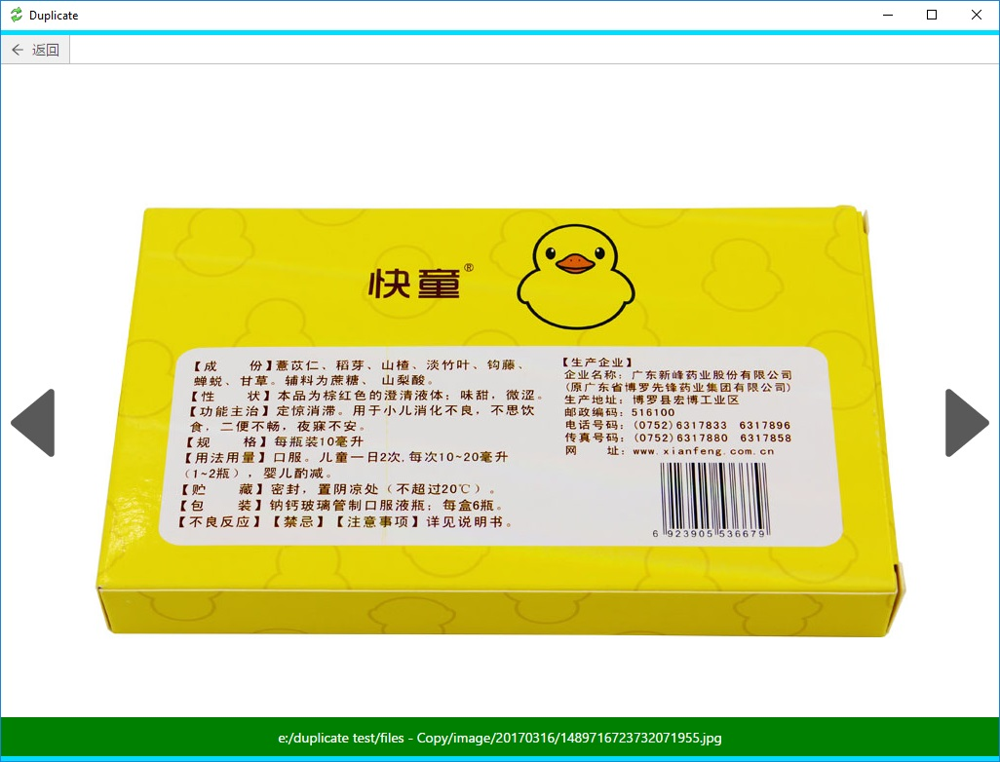

# Duplicate - 图片去重、相识图片分类 #
&nbsp; 

每个人电脑或者手机上都会保存着大量的图片，里面就有很多是重复的。图片在保存、拷贝过程中会多出许多重复，甚至整个文件夹重复，它们占用了大量的磁盘空间。 Duplicate 可以搜寻指定文件夹下所有重复的图片，默认保留一张，一键删除所有重复图片。

也有一些图片是同一个场景目标连续拍摄了很多张，最后会保留一张。实际上是所有的图片都保留了下来，占用磁盘空间不说还很混乱。 Duplicate 帮你找出所有相似图片并根据相似原因进行分类，很方便的就可以删除那些不想要的图片。

&nbsp;
## 选择文件夹 ##
首先你需要要告诉 Duplicate 那些目录下存放了图片。左边是电脑上的所有文件夹层次结构，选中后点击添加后将作为搜寻文件夹显示在右边。下一步开始扫描。

&nbsp;
## 确认重复图片 ##
扫描到的图片已缩略图的形式显示，重复图片显示为一组。默认情况下只保留一张，图中绿色部分，其余删除，标记为红色。每一张图片都可以选择保留或删除。如果两个文件夹是重复的，也就是说两个文件夹下的图片数量一样且全部重复，可以针对文件夹选择保留或删除。软件底部显示了根据当前的选择会节省多少磁盘空间。

&nbsp;
## 确认相似图片 ##
在你确认重复图片的时候，Duplicate 会在后台分析非重复文件的相似程度，将相似度高的文件列出供用户选择删除或保留。默认保留所有的相似图片，用户可以标记为删除。所有的操作和重复图片相同。根据图片相似的原因分为6个组：
- 连拍
- 格式
- 移动
- 位置
- 缩放
- 其它

双击缩略图会打开这张图片的预览图，有些相似图片只有细微的差别，缩略图不足以分辨。

&nbsp;
## 确认删除 ##
点击删除按钮 Duplicate 会删除所有标记为删除的图片，并给出一个汇总信息告诉你总共删除了多少个文件，节省了多少空间。

&nbsp;
## 下载地址 ##
- [Window 64](../downloads/duplicate.msi)
